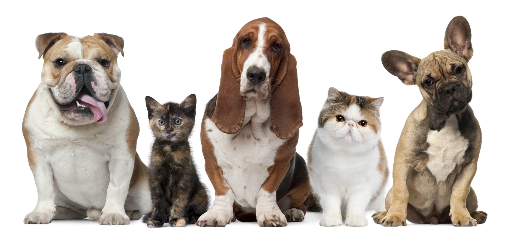

### Animal Sound Classification (Cats Vrs Dogs Audio Sentiment Classification)

This is a simple audio classification `api` build to classify the sound of an audio, weather it is the `cat` or `dog` sound.



### Response

Given a `.wav` audio the model will classify what does the sound the audio belongs to either `cat` or `dog`.

```json
{
  "predictions": {
    "class": "dog",
    "label": 1,
    "probability": 1.0
  },
  "success": true
}
```

### Starting the server

To start server and start `audio` classification first you need to make sure you are in the `server` folder and run the following commands:

1. creating a virtual environment

```shell
virtualenv venv && .\venv\Scripts\activate.bat
```

2. installing packages

```shell
pip install -r requirements.txt
```

3. Starting the server

```shell
python app/app.py
```

> The server will start on a default port of `3001` and you will be able to make api request to the server to do audio classification.

### Making API request to the server.

1. using `curl`

### Notebooks

- All notebooks for training and saving the models are found in the `notebooks` folder of this repository.
